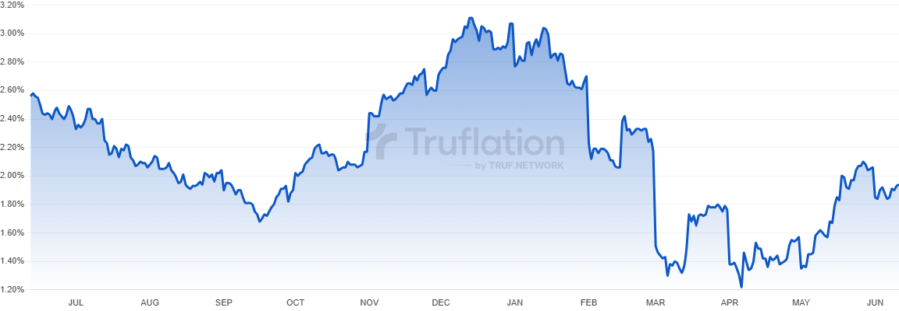

# TrackFlation 📈

**Independent, economic & financial data in real time on-chain**

TrackFlation is a modern web-based interactive dashboard designed to help users track, visualize, and understand inflation trends across the world. Built with real-time data integration from the World Bank API and featuring stunning interactive visualizations.



## 🌟 Features

### 📊 **Real-time Inflation Data**
- Live economic data from the World Bank API
- Automatic fallback to CSV data for reliability
- Support for 15+ countries worldwide
- Historical data spanning multiple decades

### 🗺️ **Interactive World Map**
- Clickable world map powered by amCharts
- Zoom and pan functionality for detailed exploration
- Click any country to view its inflation data instantly
- Smooth scrolling to chart section upon country selection

### 📈 **Dynamic Charts**
- Interactive line charts using Chart.js
- Real-time country filtering and selection
- Historical data comparison and trend analysis
- Responsive design for all screen sizes

### 🎨 **Modern UI/UX**
- Dark theme with glassmorphism effects
- Responsive design optimized for desktop and mobile
- Tailwind CSS and Bootstrap integration
- Smooth animations and transitions

### 👥 **User Management System**
- Secure user registration and authentication
- Role-based access control (Admin/User)
- Password hashing and session management
- Welcome messages for personalized experience

### 🔧 **Admin Panel**
- Complete user management interface
- Edit user details and roles
- Delete user accounts with safety checks
- Modern dark-themed admin interface

## 🚀 Quick Start

### Prerequisites
- **XAMPP** (Apache, MySQL, PHP 7.4+)
- Modern web browser (Chrome, Firefox, Safari, Edge)
- Internet connection for API data

### Installation

1. **Download and Setup XAMPP**
   ```bash
   # Download from: https://www.apachefriends.org/
   # Install and start Apache + MySQL services
   ```

2. **Clone/Download Project**
   ```bash
   # Place the project in your XAMPP htdocs folder
   C:\xampp\htdocs\PROJECT\
   ```

3. **Database Configuration**
   - Open phpMyAdmin: `http://localhost/phpmyadmin`
   - Create a new database named `project`
   - Create the users table:
   ```sql
   CREATE TABLE users (
     id INT AUTO_INCREMENT PRIMARY KEY,
     fname VARCHAR(50) NOT NULL,
     lname VARCHAR(50) NOT NULL,
     email VARCHAR(100) UNIQUE NOT NULL,
     password VARCHAR(255) NOT NULL,
     role VARCHAR(50) DEFAULT 'user'
   );
   ```

4. **Configure Database Connection**
   - Update `dbconn.php` with your credentials:
   ```php
   $servername = "localhost";
   $username = "root";
   $password = "";
   $dbname = "project";
   ```

5. **Launch Application**
   - Start XAMPP Apache and MySQL services
   - Visit: `http://localhost/PROJECT/Main Dashboard.php`

## 📁 Project Structure

```
PROJECT/
├── 📄 Main Dashboard.php       # Main dashboard and landing page
├── 🔐 signin.php              # User authentication page
├── 📝 register.php            # User registration page
├── ⚙️ process.php             # Registration form processing
├── 🚪 logout.php              # Session logout handler
├── 🗄️ dbconn.php             # Database connection configuration
├── 🎨 styles.css             # Custom CSS styling
├── 🖼️ 1.png                  # Dashboard preview image
├── 📊 inflation_data.csv     # Fallback CSV data file
├── 📋 features.html          # Features showcase page
├── 📖 README.md              # Project documentation
└── 📁 admin/                 # Admin panel directory
    ├── 👥 manage_users.php   # User management interface
    ├── ✏️ edit_user.php      # User editing functionality
    └── 🗑️ delete_user.php    # User deletion handler
```

## 🌍 Supported Countries

The platform currently supports inflation data for:

| Country | Code | Flag |
|---------|------|------|
| United States | US | 🇺🇸 |
| United Kingdom | GB | 🇬🇧 |
| Germany | DE | 🇩🇪 |
| Nigeria | NG | 🇳🇬 |
| Kenya | KE | 🇰🇪 |
| India | IN | 🇮🇳 |
| Japan | JP | 🇯🇵 |
| China | CN | 🇨🇳 |
| South Africa | ZA | 🇿🇦 |
| Brazil | BR | 🇧🇷 |
| Canada | CA | 🇨🇦 |
| France | FR | 🇫🇷 |
| Italy | IT | 🇮🇹 |
| Russia | RU | 🇷🇺 |
| Mexico | MX | 🇲🇽 |

## 👤 User Roles & Access

### 🔵 Regular User
- View real-time inflation data and interactive charts
- Access all dashboard features and visualizations
- Use interactive world map for country selection
- Browse educational resources and documentation

### 🔴 Admin User
- All regular user permissions
- Access admin panel: `http://localhost/PROJECT/admin/manage_users.php`
- Manage user accounts (view, edit, delete)
- Modify user roles and permissions
- Cannot delete own admin account (safety feature)

### Creating an Admin Account
1. Register a normal user account
2. Open phpMyAdmin → `project` database → `users` table
3. Change your account's `role` from `'user'` to `'admin'`
4. You now have admin access!

## 🛠️ Technology Stack

### Frontend Technologies
- **HTML5** - Semantic structure and accessibility
- **CSS3** - Modern styling with custom properties
- **Tailwind CSS** - Utility-first styling framework
- **Bootstrap 5** - Responsive components and layout
- **JavaScript ES6+** - Interactive functionality
- **Chart.js** - Beautiful, responsive data visualizations
- **amCharts 5** - Interactive world map with zoom/pan

### Backend Technologies
- **PHP 7.4+** - Server-side logic and processing
- **MySQL** - Relational database management
- **Apache** - Web server with mod_rewrite support

### APIs & External Services
- **World Bank Open Data API** - Real-time economic indicators
- **PapaParse** - Client-side CSV parsing library

### Development Tools
- **XAMPP** - Local development environment
- **phpMyAdmin** - Database administration interface

## 🔒 Security Features

- **Password Security**: Bcrypt hashing with salt
- **SQL Injection Prevention**: Prepared statements
- **Session Management**: Secure session handling
- **Role-Based Access**: Admin/User permission system
- **Input Validation**: Server and client-side validation
- **XSS Protection**: HTML entity encoding
- **CSRF Protection**: Session-based form validation

## 📊 Data Sources & APIs

### Primary Data Source
- **World Bank Open Data API**
- Endpoint: `https://api.worldbank.org/v2/country/{code}/indicator/FP.CPI.TOTL.ZG`
- Format: JSON with automatic error handling
- Update Frequency: Annual data with real-time API access

### Fallback Data
- Local CSV file with historical inflation data
- Automatic fallback when API is unavailable
- Parsed using PapaParse for consistent formatting

## 🌐 Usage Guide

### For End Users
1. **Getting Started**
   - Visit the main dashboard
   - Register for an account or sign in
   - Explore the interactive features

2. **Viewing Data**
   - Select countries from the dropdown menu
   - Click on the interactive world map
   - Analyze trends in the dynamic charts

3. **Navigation**
   - Use the top navigation to explore different sections
   - Access resources for learning about inflation
   - View project information in the About section

### For Administrators
1. **Accessing Admin Panel**
   - Ensure your account has admin privileges
   - Navigate to `/admin/manage_users.php`
   - Manage users through the interface

2. **User Management**
   - View all registered users in a table format
   - Edit user information and roles
   - Delete users (with confirmation prompts)

## 🚨 Troubleshooting

### Common Issues & Solutions

**Database Connection Failed**
```
Solution: 
- Check XAMPP MySQL service is running
- Verify credentials in dbconn.php
- Ensure database 'project' exists
```

**Charts Not Loading**
```
Solution:
- Check browser console for JavaScript errors
- Verify internet connection for API access
- Ensure Chart.js CDN is accessible
```

**Admin Panel Access Denied**
```
Solution:
- Verify user role is set to 'admin' in database
- Clear browser cache and cookies
- Check session is active
```

**Map Not Interactive**
```
Solution:
- Verify amCharts CDN resources are loading
- Check browser compatibility (modern browsers required)
- Ensure JavaScript is enabled
```

## 🔄 API Rate Limits & Handling

- **World Bank API**: No strict rate limits for public use
- **Fallback System**: Automatic CSV fallback prevents data loss
- **Error Handling**: Graceful degradation with user notifications
- **Caching**: Client-side caching for improved performance

## 📈 Future Roadmap

### Version 2.0 Features
- [ ] **Additional Economic Indicators**
  - GDP growth rates
  - Unemployment statistics
  - Currency exchange rates

- [ ] **Enhanced Visualizations**
  - Multiple chart types (bar, pie, area)
  - Comparative country analysis
  - Time-range selector

- [ ] **Export Capabilities**
  - PDF report generation
  - CSV data export
  - Chart image downloads

- [ ] **User Experience**
  - Dashboard customization
  - Saved preferences
  - Email notifications

- [ ] **Mobile Features**
  - Progressive Web App (PWA)
  - Offline data access
  - Touch-optimized interactions

## 🤝 Contributing

We welcome contributions! Here's how you can help:

1. **Fork the Repository**
2. **Create Feature Branch**: `git checkout -b feature/amazing-feature`
3. **Commit Changes**: `git commit -m 'Add amazing feature'`
4. **Push to Branch**: `git push origin feature/amazing-feature`
5. **Open Pull Request**

### Contribution Guidelines
- Follow existing code style and conventions
- Add comments for complex functionality
- Test thoroughly before submitting
- Update documentation as needed

## 📝 License

This project is developed for **educational purposes** as part of an academic software engineering initiative. 

**Usage Rights:**
- ✅ Educational and learning purposes
- ✅ Portfolio demonstration
- ✅ Non-commercial research
- ❌ Commercial redistribution without permission

## 👨‍💻 Developer Information

**Mungai John**  
*Software Engineering Alumni*

📧 **Email**: [johnegichuho@gmail.com](mailto:johnegichuho@gmail.com)  
📞 **Phone**: +254745491216  
🎓 **Institution**: Software Engineering Program  
🗓️ **Year**: 2025

### Project Context
This application was developed as a capstone project demonstrating:
- Full-stack web development skills
- API integration and data visualization
- Database design and management
- User authentication and security
- Modern responsive web design
- Real-world problem solving

## 🙏 Acknowledgments

- **World Bank Group** - For providing free access to economic data APIs
- **Chart.js Community** - For the excellent charting library
- **amCharts** - For the interactive mapping solution
- **Tailwind CSS Team** - For the utility-first CSS framework
- **Academic Supervisors** - For guidance and project oversight

## 📊 Project Statistics

- **Development Time**: 3 months
- **Lines of Code**: ~2,000+
- **Database Tables**: 1 (users)
- **Supported Countries**: 15+
- **API Integrations**: 1 (World Bank)
- **JavaScript Libraries**: 4 (Chart.js, amCharts, PapaParse, Tailwind)

---

**© 2025 TrackFlation. All rights reserved.**

*Empowering economic understanding through interactive data visualization.*

---

### 🔗 Quick Links

- [Live Demo](http://localhost/PROJECT/Main Dashboard.php)
- [Admin Panel](http://localhost/PROJECT/admin/manage_users.php)
- [World Bank API Documentation](https://datahelpdesk.worldbank.org/knowledgebase/articles/889392)
- [Chart.js Documentation](https://www.chartjs.org/docs/latest/)
- [amCharts Documentation](https://www.amcharts.com/docs/v5/)

**Ready to explore global inflation trends? [Get Started Now!](http://localhost/PROJECT/Main Dashboard.php)**